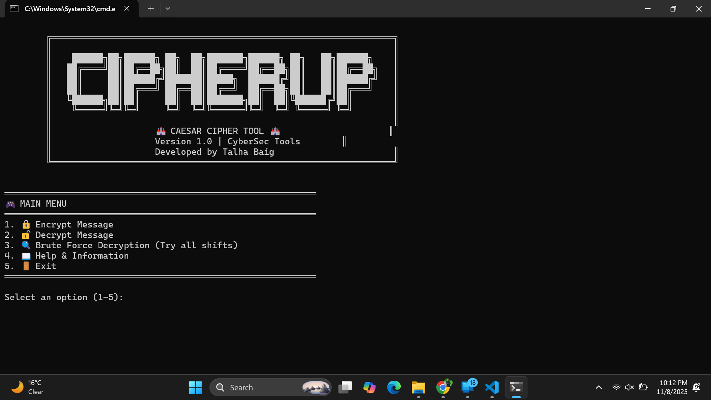

# 🔐 CipherVault Pro - Caesar Cipher Tool


A powerful and user-friendly Caesar Cipher encryption/decryption tool built with Python. Experience classical cryptography with a modern interface!

## 🏰 Features

- 🔒 **Encryption**: Secure your messages with Caesar Cipher
- 🔓 **Decryption**: Decrypt messages with known shift value  
- 🔍 **Brute Force Attack**: Try all 25 possible shifts
- 🎨 **Beautiful UI**: Professional banner and interactive menu
- 💡 **Educational**: Learn about classical cryptography
- 🛡️ **Safe**: Handles uppercase, lowercase, and special characters

## 📸 Screenshots




## 🚀 Quick Start

### Prerequisites
- Python 3.6 or higher
- Git (for cloning repository)

### Installation

1. **Clone the repository**
   ```bash
   git clone https://github.com/talhabaig007/CipherVault-Pro.git
   ```
   ```bash
   cd CipherVault-Pro
   ```
   Run the Tool
   ```bash
   python CipherVault.py
   ```
2. **Direct Download**
   ```bash
    wget https://raw.githubusercontent.com/talhabaig007/CipherVault-Pro/main/CipherVault.py
   ```
   ```bash
    python CipherVault.py
   ```
# 🎮 How to Use

═🎮 MAIN MENU═
1. 🔒 Encrypt Message
2. 🔓 Decrypt Message  
3. 🔍 Brute Force Decryption (Try all shifts)
4. 📖 Help & Information
5. 🚪 Exit

## Encryption Example

- Enter message to encrypt: HELLO WORLD
- Enter shift value (0-25): 3
- Encrypted Text: KHOOR ZRUOG

## Decryption Example

- Enter message to decrypt: KHOOR ZRUOG
- Enter shift value (0-25): 3
- Decrypted Text: HELLO WORLD

## 🧠 How Caesar Cipher Works

**Algorithm**
- Each letter is shifted by a fixed number in the alphabet
- Encryption: Shift forward → H + 3 = K
- Decryption: Shift backward → K - 3 = H
- Only alphabetic characters are modified
- Non-alphabetic characters remain unchanged

## Mathematical Formula
- Encryption: E(x) = (x + k) mod 26
- Decryption: D(x) = (x - k) mod 26

## 📚 Educational Value
**This tool demonstrates:**
- Classical cryptography principles
- Substitution cipher techniques
- Brute force attack methods
- Modular arithmetic in cryptography
- Historical encryption methods

## 🛡️ Security Notes
**Warning: Caesar Cipher is for educational purposes only!**
- Only 25 possible keys
- Easily broken by frequency analysis
- Not suitable for secure communications
- Mainly used to learn cryptography basics

## Dependencies
- Python Standard Library only
- No external packages required

## Compatibility
- ✅ Windows
- ✅ Linux
- ✅ macOS
- ✅ Any Python 3.6+ environment

## ⚖️ License

This project is licensed under the MIT License - see the [LICENSE](LICENSE) file for details.

## 🧠 Author

**Talha Baig**  
[🌐 Website](https://talhabaig.exploreeverything.blog/)  
[🐙 GitHub](https://github.com/talhabaig007)  
[📷 Instagram](https://www.instagram.com/talhabaig007/)  
[🐦 Twitter](https://www.twitter.com/talhabaig007/)  
[📘 Facebook](https://www.facebook.com/p/Talha-Baig-100063795712836/)  
📧 Email: baig78@hackermail.com

## ⚠️ Disclaimer

This tool is developed for **educational** and **ethical testing purposes** only. Any misuse of this tool is **not the responsibility** of the developer. Use it only on systems you own or have permission to test.
